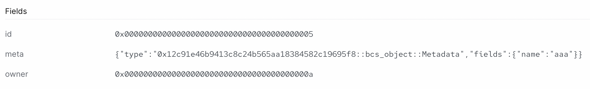

# BCS Encoding

Binary Canonical Serialization, or BCS, is a serialization format developed in the context of the Diem blockchain, and is now extensively used in most of the blockchains based on Move (Sui, Starcoin, Aptos, 0L). BCS is not only used in the Move VM, but also used in transaction and event coding, such as serializing transactions before signing, or parsing event data. 

Knowing how BCS works is crucial if you want to understand how Move works at a deeper level and become a Move expert. Let's dive in.

## BCS Specification and Properties

There are some high-level properties of BCS encoding that are good to keep in mind as we go through the rest of the lesson:

- BCS is a data-serialization format where the resulting output bytes do not contain any type information; because of this, the side receiving the encoded bytes will need to know how to deserialize the data
- There are no structs in BCS (since there are no types); the struct simply defines the order in which fields are serialized
- Wrapper types are ignored, so `OuterType` and `UnnestedType` will have the same BCS representation:

    ```move
    struct OuterType {
        owner: InnerType
    }
    struct InnerType {
        address: address
    }
    struct UnnestedType {
        address: address
    }
    ```
- Types containing the generic type fields can be parsed up to the first generic type field. So it's a good practice to put the generic type field(s) last if it's a custom type that will be ser/de'd.
    ```move
    struct BCSObject<T> has drop, copy {
        id: ID,
        owner: address,
        meta: Metadata,
        generic: T
    }
    ```
    In this example, we can deserialize everything up to the `meta` field. 
- Primitive types like unsigned ints are encoded in Little Endian format
- Vector is serialized as a [ULEB128](https://en.wikipedia.org/wiki/LEB128) length (with max length up to `u32`) followed by the content of the vector.

The full BCS specification can be found in [the BCS repository](https://github.com/zefchain/bcs).

## Using the `@mysten/bcs` JavaScript Library

### Installation

The library you will need to install for this part is the [@mysten/bcs library](https://www.npmjs.com/package/@mysten/bcs). You can install it by typing in the root directory of a node project:

```bash
npm i @mysten/bcs
```

### Basic Example

Let's use the JavaScript library to serialize and de-serialize some simple data types first:

```javascript
import { BCS, getSuiMoveConfig } from "@mysten/bcs";

// initialize the serializer with default Sui Move configurations
const bcs = new BCS(getSuiMoveConfig());

// Define some test data types
const integer = 10;
const array = [1, 2, 3, 4];
const string = "test string"

// use bcs.ser() to serialize data
const ser_integer = bcs.ser(BCS.U16, integer);
const ser_array = bcs.ser("vector<u8>", array);
const ser_string = bcs.ser(BCS.STRING, string);

// use bcs.de() to deserialize data
const de_integer = bcs.de(BCS.U16, ser_integer.toBytes());
const de_array = bcs.de("vector<u8>", ser_array.toBytes());
const de_string = bcs.de(BCS.STRING, ser_string.toBytes());

```

We can initialize the serializer instance with the built-in default setting for Sui Move using the above syntax, `new BCS(getSuiMoveConfig())`. 

There are built-in ENUMs that can be used for Sui Move types like `BCS.U16`, `BCS.STRING`, etc. For [generic types](../../../unit-three/lessons/2_intro_to_generics.md), it can be defined using the same syntax as in Sui Move, like `vector<u8>` in the above example. 

Let's take a close look at the serialized and deserialized fields:

```bash
# ints are little-endian hexadecimals
0a00
10
# the first element of a vector indicates the total length,
# then it's just whatever elements are in the vector
0401020304
1,2,3,4
# strings are just vectors of u8's, with the first element equal to the length of the string
0b7465737420737472696e67
test string
```

### Type Registration

We can register the custom types we will be working with using the following syntax:

```javascript
import { BCS, getSuiMoveConfig } from "@mysten/bcs";
const bcs = new BCS(getSuiMoveConfig());

// Register the Metadata Type
bcs.registerStructType("Metadata", {
  name: BCS.STRING,
});

// Same for the main object that we intend to read
bcs.registerStructType("BCSObject", {
  // BCS.ADDRESS is used for ID types as well as address types
  id: BCS.ADDRESS,
  owner: BCS.ADDRESS,
  meta: "Metadata",
});
```

## Using `bcs` in Sui Smart Contracts

Let's continue our example from above with the structs. 

### Struct Definition

We start with the corresponding struct definitions in the Sui Move contract.

```move
{
    //..
    struct Metadata has drop, copy {
        name: std::ascii::String
    }

    struct BCSObject has drop, copy {
        id: ID,
        owner: address,
        meta: Metadata
    }
    //..
}
```

### Deserialization

Now, let's write the function to deserialize an object in a Sui contract. 

```move
    public fun object_from_bytes(bcs_bytes: vector<u8>): BCSObject {

        // Initializes the bcs bytes instance
        let bcs = bcs::new(bcs_bytes);

        // Use `peel_*` functions to peel values from the serialized bytes. 
        // Order has to be the same as we used in serialization!
        let (id, owner, meta) = (
        bcs::peel_address(&mut bcs), bcs::peel_address(&mut bcs), bcs::peel_vec_u8(&mut bcs)
        );
        // Pack a BCSObject struct with the results of serialization
        BCSObject { id: object::id_from_address(id), owner, meta: Metadata {name: std::ascii::string(meta)}  } }

```

The varies `peel_*` methods in Sui Frame [`bcs` module](https://github.com/MystenLabs/sui/blob/main/crates/sui-framework/docs/sui/bcs.md) are used to "peel" each individual field from the BCS serialized bytes. Note that the order we peel the fields must be exactly the same as the order of the fields in the struct definition. 

_Quiz: Why are the results not the same from the first two `peel_address` calls on the same `bcs` object?_

Also note how we convert the types from `address` to `id`, and from `vector<8>` to `std::ascii::string` with helper functions.

_Quiz: What would happen if `BSCObject` had a `UID` type instead of an `ID` type?_

## Complete Ser/De Example

Find the full JavaScript and Sui Move sample codes in the [`example_projects`](../example_projects/) folder.

First, we serialize a test object using the JavaScript program:

```javascript
// We construct a test object to serialize, note that we can specify the format of the output to hex
let _bytes = bcs
  .ser("BCSObject", {
    id: "0x0000000000000000000000000000000000000005",
    owner: "0x000000000000000000000000000000000000000a",
    meta: {name: "aaa"}
  })
  .toString("hex");
```

We want the BCS writer's output to be in hexadecimal format this time, which can be specified like above. 

Affix the serialization result hexstring with `0x` prefix and export to an environmental variable:

```bash
export OBJECT_HEXSTRING=0x0000000000000000000000000000000000000005000000000000000000000000000000000000000a03616161
```

Now we can either run the associated Move unit tests to check for correctness:

```bash 
sui move test
```

You should see this in the console:

```bash
BUILDING bcs_move
Running Move unit tests
[ PASS    ] 0x0::bcs_object::test_deserialization
Test result: OK. Total tests: 1; passed: 1; failed: 0
```
Or we can publish the module (and export the PACKAGE_ID) and call the `emit_object` method using the above BCS serialized hexstring:

```bash
sui client call --function emit_object --module bcs_object --package $PACKAGE_ID --args $OBJECT_HEXSTRING 
```

We can then check the `Events` tab of the transaction on the Sui Explorer to see that we emitted the correctly deserialized `BCSObject`:




