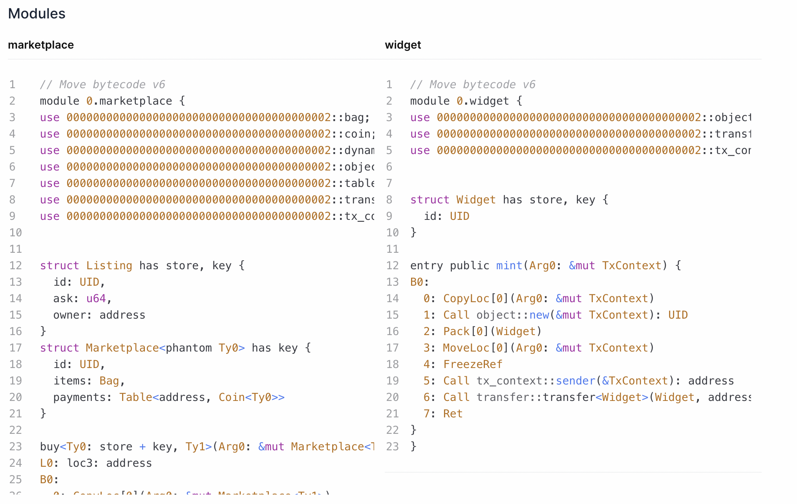
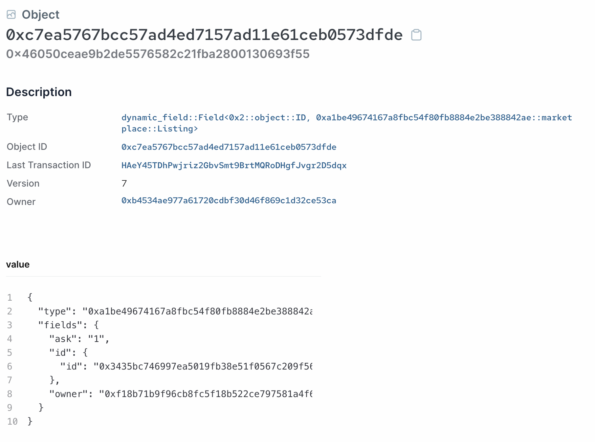

# Deployment and Testing

Next we can deploy and test our marketplace contract through the SUI CLI. 

We create a simple `marketplace::widget` module so we can mint some items for us to list to help with testing.

```move
module marketplace::widget {

    use sui::object::{Self, UID};
    use sui::transfer;
    use sui::tx_context::{Self, TxContext};

    public struct Widget has key, store {
        id: UID,
    }

    public fun mint(ctx: &mut TxContext) {
        let object = Widget {
            id: object::new(ctx)
        };
        transfer::transfer(object, tx_context::sender(ctx));
    }
}
```

This is basically the Hello World project from Unit One, but made even simpler. 

## Deployment

Publish the package using:

```bash
    sui client publish
```

You should see both `marketplace` and `widget` modules published on the explorer: 



Export the package object ID into an environmental variable:

```bash
    export PACKAGE_ID=<package object ID from previous output>
```

## Initialize the Marketplace

Next, we need to initialize the marketplace contract by calling the `create` entry function. We want to pass it a type argument to specify which type of fungible token this marketplace will accept. It's easiest to just use the `Sui` native token here. We can use the following CLI command: 

```bash
    sui client call --function create --module marketplace --package $PACKAGE_ID --type-args 0x2::sui::SUI
```

Note the syntax for passing in the type argument for `SUI` token. 

Export the `Marketplace` shared object's ID into an environmental variable:

```bash
    export MARKET_ID=<marketplace shared object ID from previous output>
```

## Listing

First, we mint a `widget` item to be listed:

```bash
    sui client call --function mint --module widget --package $PACKAGE_ID 
```

Save the object item of the minted `widget` to an environmental variable:

```bash
    export ITEM_ID=<object ID of the widget item from console>
```

Then we list this item to our marketplace:

```bash
    sui client call --function list --module marketplace --package $PACKAGE_ID --args $MARKET_ID $ITEM_ID 1 --type-args $PACKAGE_ID::widget::Widget 0x2::sui::SUI 
```

We need to submit two type arguments here, first is the type of the item to be listed and second is the fungible coin type for the payment. The above example uses a listing price of `1`. 

After submitting this transaction, you can check the newly created listing on the [Sui explorer](https://suiexplorer.com/):



## Purchase

Split out a `SUI` coin object of amount `1` to use as the payment object. You can use the `sui client gas` CLI command to see a list of available `SUI` coins under your account and pick one to be split.

```bash
    sui client split-coin --coin-id <object ID of the coin to be split> --amounts 1 
```

Export the object ID of the newly split `SUI` coin with balance `1`:

```bash
    export PAYMENT_ID=<object ID of the split 1 balance SUI coin>
```

Now, let's buy back the item that we just listed:

```bash
    sui client call --function buy_and_take --module marketplace --package $PACKAGE_ID --args $MARKET_ID $ITEM_ID $PAYMENT_ID --type-args $PACKAGE_ID::widget::Widget 0x2::sui::SUI 
```

You should see a long list of transaction effects in the console after submitting this transaction. We can verify that the `widget` is owned by our address, and the `payments` `Table` now has an entry with the key of our address and should be of size `1`.

### Take Profits

Finally, we can claim our earnings by calling the `take_profits_and_keep` method:

```bash
    sui client call --function take_profits_and_keep --module marketplace --package $PACKAGE_ID --args $MARKET_ID --type-args 0x2::sui::SUI 
```

This will reap the balance from the `payments` `Table` object and return its size to `0`. Verify this on the explorer. 
