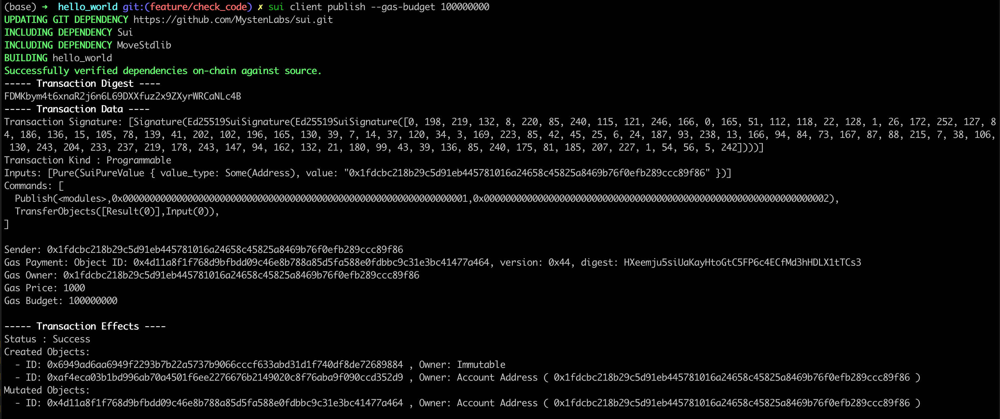
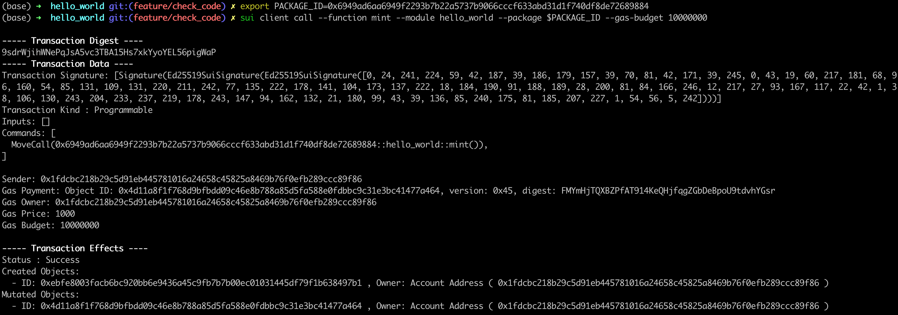
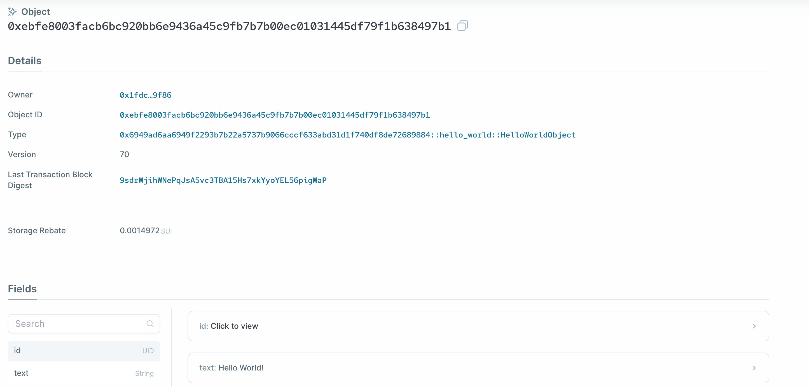

# Contract Deployment and Hello World Demo

## The Complete Hello World Sample Project

You can find the complete Hello World project in [this directory](../example_projects/hello_world). 

## Deploying the Contract

We will use the Sui CLI to deploy the package to the Sui network. You can deploy it to either the Sui devnet, testnet, or 
the local node. Just set the Sui CLI to the respective network and have enough tokens to pay for gas. 

The Sui CLI command for deploying the package is the following:

```bash
sui client publish [absolute file path to the package that needs to be published]
```

If the absolute file path to the package is not provided, it will default to `.` or the current directory. 

The output should look something like this if the contract was successfully deployed:



The object ID under the `Published Objects` section is the object ID of the Hello World package we just published.

Let's export that to a variable. 

```bash
export PACKAGE_ID=<package object ID from previous output>
```

## Calling a Method through a Transaction

Next, we want to mint a Hello World object by calling the `mint` function in the smart contract we just deployed.

Note that we are able to do this because `mint` is an entry function. 

The command for this using Sui CLI is:

```bash
sui client call --function mint --module hello_world --package $PACKAGE_ID 
```

The console output should look like this if the `mint` function was successfully called and a Hello World object was created and transferred:



The object ID under the `Created Objects` section of the output is the ID of the Hello World object.

## Viewing the Object with Sui Explorer

Let's use the [Sui Explorer](https://suiexplorer.com/) to view the Hello World object we just created and transferred.

Choose the network you are using through the dropdown menu on the upper right. 

If you are using a local dev node, select the `Custom RPC URL` option and enter:

```bash
http://127.0.0.1:9000
```

Search for the object ID from the output of the previous transaction and you should be able to find the object on the explorer:



You should see the text "Hello World!" under the object's properties. 

Great job, this concludes the first unit of the course.
