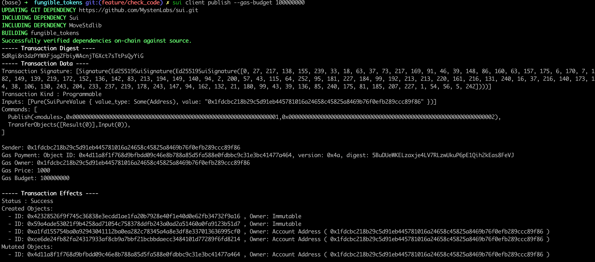
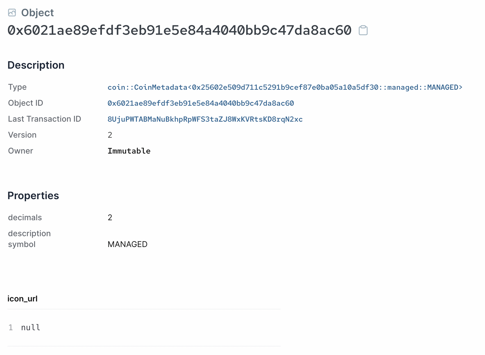
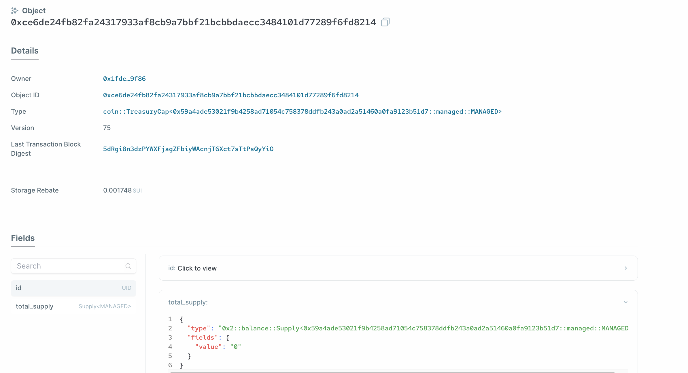
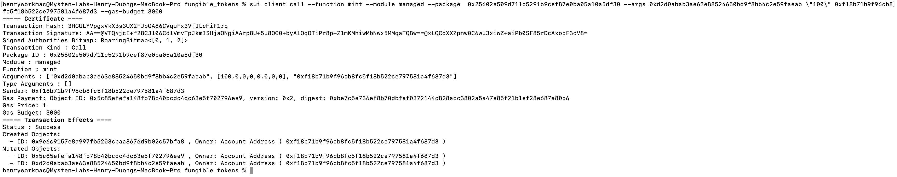

# Managed Coin Example

Now we have peeked under the hood of the `sui::coin` module, we can look at a simple, but complete example of creating a type of custom fungible token where there is a trusted manager that has the capability to mint and burn, similar to many ERC-20 implementations. 

## Smart Contract

You can find the complete [Managed Coin contract](../example_projects/fungible_tokens/sources/managed.move) under the example project folder.

Given what we have covered so far, this contract should be very easy to understand. It follows the [One Time Witness](./3_witness_design_pattern.md#one-time-witness) pattern, where the `witness` resource is named `MANAGED`, and automatically created by the module `init` function. 

The `init` function then calls `coin::create_currency` to get the `TreasuryCap` and `CoinMetadata` resources. The parameters passed into this function are the fields of the `CoinMetadata` object, so include the token name, symbol, icon URL, etc. 

The `CoinMetadata` is immediately frozen after creation via the `transfer::freeze_object` method, so that it becomes a [shared immutable object](../../unit-two/lessons/2_ownership.md#shared-immutable-objects) that can be read by any address. 

The `TreasuryCap` [Capability](../../unit-two/lessons/6_capability_design_pattern.md) object is used as a way to control access to the `mint` and `burn` methods that create or destroy `Coin<MANAGED>` objects respectively. 

## Publishing and CLI Testing

### Publish the Module

Under the [fungible_tokens](../example_projects/fungible_tokens/) project folder, run:

```bash
    sui client publish --gas-budget 30000
```

You should see console output similar to:



The two immutable objects created are respectively the package itself, `CoinMetadata` of Managed Coin. And the owned object is the `TreasuryCap` object of Managed Coin. 





Export the object ID's of the package object and the `TreasuryCap` object:

```bash
export PACKAGE_ID=<package object ID from previous output>
export TREASURYCAP_ID=<treasury cap object ID from previous output>
```

### Minting Tokens

To mint some `MNG` tokens, we can use the following CLI command:

```bash
    sui client call --function mint --module managed --package $PACKAGE_ID --args $TREASURYCAP_ID \"<amount to mint>\" <recipient address> --gas-budget 3000
```

*💡Note: as of Sui binary version 0.21.0, `u64` inputs must be escaped as strings, thus the above CLI command format. This might change in future versions.*



Export the object ID's of the newly minted `COIN<MANGED>` object to a bash variable:

```bash
export COIN_ID=<coin object ID from previous output>
```

### Burning Tokens

To burn an existing `COIN<MANAGED>` object, we use the following CLI command:

```bash
    sui client call --function burn --module managed --package $PACKAGE_ID --args $TREASURYCAP $COIN_ID --gas-budget 3000
```

*Exercise: What other commonly used functions do fungible tokens need? You should know enough about programming in Move now to try to implement some of these functions.*