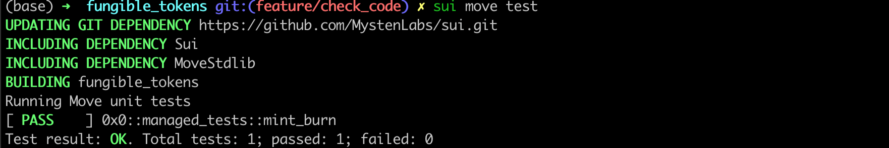

# Unit Testing

Sui supports the [Move Testing Framework](https://github.com/move-language/move/blob/main/language/documentation/book/src/unit-testing.md). Here, we will create some unit tests for `Managed Coin` to show how to write unit tests and run them.

## Testing Environment

Sui Move test code is just like any other Sui Move code, but it has special annotations and functions to distinguish it from the actual production code.
Test functions or modules start with the `#[test]` or `#[test_only]` annotation. 

```move
#[test_only]
module fungible_tokens::managed_tests {
  #[test]
  fun mint_burn() {
  }
}
```

We will put the unit tests for `Managed Coin` into a separate testing module called `managed_tests`. 

Each function inside this module can be seen as one unit test consisting of one or more transactions. We'll write one unit test called `mint_burn`. 

## Test Scenario

Inside the testing environment, we will be mainly leveraging the [`test_scenario` package](https://github.com/MystenLabs/sui/blob/main/crates/sui-framework/packages/sui-framework/sources/test/test_scenario.move) to simulate a runtime environment. The main object we need to understand and interact with here is the `Scenario` object. A `Scenario` simulates a multi-transaction sequence, and it can be initialized with the sender address as follows:

```move
  // Initialize a mock sender address
  let addr1 = @0xA;
  // Begins a multi-transaction scenario with addr1 as the sender
  let scenario = test_scenario::begin(addr1);
  ...
  // Cleans up the scenario object
  test_scenario::end(scenario);  
```

*💡Note that the `Scenario` object is not droppable, so it must be explicitly cleaned up at the end of its scope using `test_scenario::end`.*

### Initializing the Module State

To test our `Managed Coin` module, we need first to initialize the module state. Given that our module has an `init` function, we need to first create a `test_only` init function inside the `managed` module:

```move
#[test_only]
    /// Wrapper of module initializer for testing
    public fun test_init(ctx: &mut TxContext) {
        init(MANAGED {}, ctx)
    }
```

This is essentially a mock `init` function that can only be used for testing. Then we can initialize the runtime state in our scenario by simply calling this function:

```move
    // Run the managed coin module init function
    {
        managed::test_init(ctx(&mut scenario))
    };
```

### Minting 

We use the [`next_tx` method](https://github.com/MystenLabs/sui/blob/main/crates/sui-framework/packages/sui-framework/sources/test/test_scenario.move#L103) to advance to the next transaction in our scenario where we want to mint a `Coin<MANAGED>` object.

To do this, we need first to extract the `TreasuryCap<MANAGED>` object. We use a special testing function called `take_from_sender` to retrieve this from our scenario. Note that we need to pass into `take_from_sender` the type parameter of the object we are trying to retrieve. 

Then we simply call the `managed::mint` using all the necessary parameters. 

At the end of this transaction, we must return the `TreasuryCap<MANAGED>` object to the sender address using `test_scenario::return_to_address`.

```move
next_tx(&mut scenario, addr1);
        {
            let treasurycap = test_scenario::take_from_sender<TreasuryCap<MANAGED>>(&scenario);
            managed::mint(&mut treasurycap, 100, addr1, test_scenario::ctx(&mut scenario));
            test_scenario::return_to_address<TreasuryCap<MANAGED>>(addr1, treasurycap);
        };
```

### Burning 

To test burning a token, the procedure is very similar to testing minting. The only difference is that we must also retrieve a `Coin<MANAGED>` object from the person it was minted to.

## Running Unit Tests

The full [`managed_tests`](../example_projects/fungible_tokens/sources/managed_tests.move) module source code can be found under `example_projects` folder.

To execute the unit tests, navigate to the project directory in CLI and enter the following command:

```bash
  sui move test
```

You should see console output indicating which unit tests have passed or failed.




