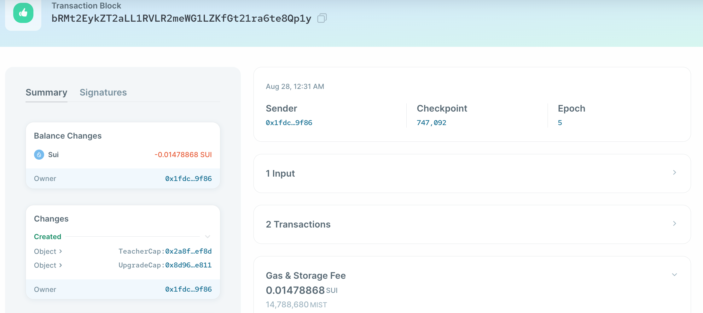
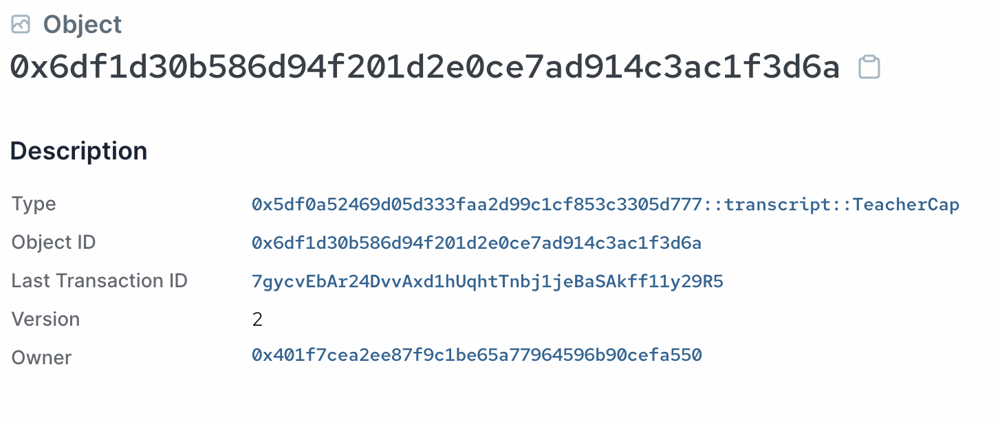

# Capability Design Pattern

Now we have the basics of a transcript publishing system, we want to add some access control to our smart contract. 

Capability is a commonly used pattern in Move that allows fine-tuned access control using an object-centric model. Let's take a look at how we can define this capability object:

```move
  // Type that marks the capability to create, update, and delete transcripts
public struct TeacherCap has key {
    id: UID
  }
```

We define a new struct `TeacherCap` that marks the capability to perform privileged actions on transcripts. If we want the capability to be non-transferrable, we simply do not add the `store` ability to the struct. 

*💡Note: This is also how the equivalent of soulbound tokens (SBT) can be easily implemented in Move. You simply define a struct that has the `key` ability, but not the `store` ability. 

## Passing and Consuming Capability Objects

Next, we need to modify the methods which should be callable by someone with the `TeacherCap` capability object to take in the capability as an extra parameter and consume it immediately. 

For example, for the `create_wrappable_transcript_object` method, we can modify it as the follows:

```move
    public fun create_wrappable_transcript_object(_: &TeacherCap, history: u8, math: u8, literature: u8, ctx: &mut TxContext) {
        let wrappableTranscript = WrappableTranscript {
            id: object::new(ctx),
            history,
            math,
            literature,
        };
        transfer::transfer(wrappableTranscript, tx_context::sender(ctx))
    }
```

We pass in a reference to `TeacherCap` capability object and consume it immediately with the `_` notation for unused variables and parameters. Note that because we are only passing in a reference to the object, consuming the reference has no effect on the original object. 

*Quiz: What happens if try to pass in `TeacherCap` by value?*

This means only an address that has a `TeacherCap` object can call this method, effectively implementing access control on this method.

We make similar modifications to all other methods in the contract that perform privileged actions on transcripts. 

## Initializer Function

A module's initializer function is called once upon publishing the module. This is useful for initializing the state of the smart contract, and is used often to send out the initial set of capability objects. 

In our example, we can define the `init` method as the following:

```move
    /// Module initializer is called only once on module publish.
    fun init(ctx: &mut TxContext) {
        transfer::transfer(TeacherCap {
            id: object::new(ctx)
        }, tx_context::sender(ctx))
    }
```

This will create one copy of the `TeacherCap` object and send it to the publisher's address when the module is first published. 

We can see the publish transaction's effects on the [Sui Explorer](../../unit-one/lessons/6_hello_world.md#viewing-the-object-with-sui-explorer) as below:



The second object created from the above transaction is an instance of the `TeacherCap` object, and sent to the publisher address:



*Quiz: What was the first object created?*

## Add Additional Teachers or Admins

In order to give additional addresses admin access, we can simply define a method to create and send additional `TeacherCap` objects as the following:

```move
    public fun add_additional_teacher(_: &TeacherCap, new_teacher_address: address, ctx: &mut TxContext){
        transfer::transfer(
            TeacherCap {
                id: object::new(ctx)
            },
        new_teacher_address
        )
    }
```

This method re-uses the `TeacherCap` to control access, but if needed, you can also define a new capability struct indicating sudo access. 

**Here is the third work-in-progress version of what we have written so far: [WIP transcript.move](../example_projects/transcript/sources/transcript_3.move_wip)**
