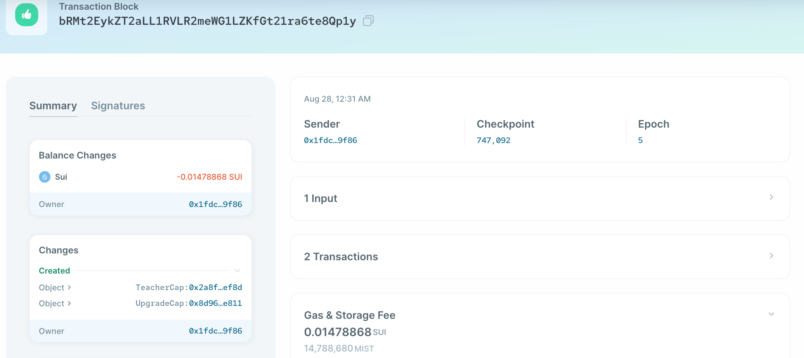
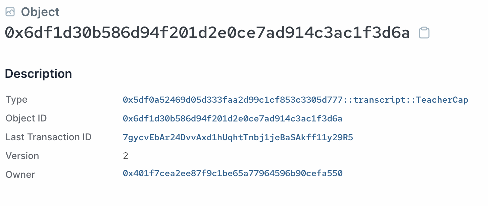

# Capability Design Pattern

Now we have the basics of a transcript publishing system, we want to add some access control to our smart contract.

Capability is a commonly used pattern in Sui Move that allows fine-tuned access control using an object-centric model. Capability types are conventionally suffixed with `Cap`. Define the capability object as follows:

```move
// Type that marks the capability to create, update, and delete transcripts
public struct TeacherCap has key, store {
    id: UID,
}
```

We define a new struct `TeacherCap` that marks the capability to perform privileged actions on transcripts. With `key` and `store`, the capability can be transferred (e.g., to add more teachers). If you need a non-transferable capability (e.g., soulbound), omit the `store` ability.

\*💡Note: This is also how the equivalent of soulbound tokens (SBT) can be easily implemented in Move. You simply define a struct that has the `key` ability, but not the `store` ability.

## Passing and Consuming Capability Objects

Next, we need to modify the methods which should be callable by someone with the `TeacherCap` capability object to take in the capability as an extra parameter and consume it immediately.

For example, for the `create_wrappable_transcript_object` method, we can modify it as the follows:

```move
public fun create_wrappable_transcript_object(
    _: &TeacherCap,
    history: u8,
    math: u8,
    literature: u8,
    ctx: &mut TxContext,
) {
    let wrappable_transcript = WrappableTranscript {
        id: object::new(ctx),
        history,
        math,
        literature,
    };
    transfer::public_transfer(wrappable_transcript, ctx.sender())
}
```

We pass in a reference to `TeacherCap` capability object and consume it immediately with the `_` notation for unused variables and parameters. Note that because we are only passing in a reference to the object, consuming the reference has no effect on the original object.

_Quiz: What happens if try to pass in `TeacherCap` by value?_

This means only an address that has a `TeacherCap` object can call this method, effectively implementing access control on this method.

We make similar modifications to all other methods in the contract that perform privileged actions on transcripts.

## Initializer Function

The package initializer is run once when the module is published. Use `fun init` to set up initial state and often to send the initial capability objects.

In our example we define `fun init` as follows:

```move
/// Called only once on module publish.
fun init(ctx: &mut TxContext) {
    transfer::transfer(TeacherCap {
        id: object::new(ctx)
    }, ctx.sender())
}
```

This will create one copy of the `TeacherCap` object and send it to the publisher's address when the module is first published.

We can see the publish transaction's effects on the [Sui Explorer](../../unit-one/lessons/6_hello_world.md#viewing-the-object-with-sui-explorer) as below:



The second object created from the above transaction is an instance of the `TeacherCap` object, and sent to the publisher address:



_Quiz: What was the first object created?_

## Add Additional Teachers or Admins

In order to give additional addresses admin access, we can simply define a method to create and send additional `TeacherCap` objects as the following:

```move
public fun add_additional_teacher(
    _: &TeacherCap,
    new_teacher_address: address,
    ctx: &mut TxContext,
) {
    transfer::transfer(
        TeacherCap {
            id: object::new(ctx),
        },
        new_teacher_address,
    )
}
```

This method re-uses the `TeacherCap` to control access, but if needed, you can also define a new capability struct indicating sudo access.

**Here is the third work-in-progress version of what we have written so far: [WIP transcript.move](../example_projects/transcript/sources/transcript_3.move_wip)**
