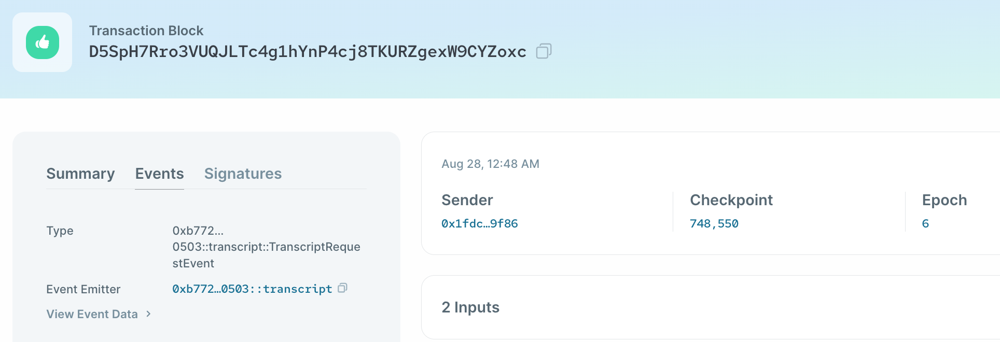
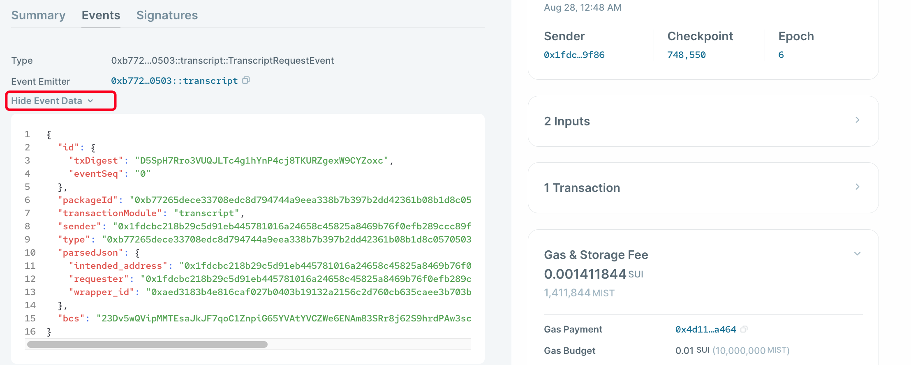

# Events

Events are important for Sui Move smart contracts, as it is the main way for indexers to track actions on-chain. You can understand it as logging on server backends, and indexers as parsers.

Events on Sui are also represented as objects. There are several types of system level events in Sui, including Move event, Publish event, Transfer object event, and so on. For the full list of system event types, please refer to the [Sui Events API page here](https://docs.sui.io/build/event_api).

The event details of a transaction can be viewed on the [Sui Explorer](https://explorer.sui.io/) under the `Events` tab:



## Custom Events

Developers can also define custom events on Sui. We can define a custom event marking when a transcript has been requested in the following way.

```rust
    /// Event marking when a transcript has been requested
    struct TranscriptRequestEvent has copy, drop {
        // The Object ID of the transcript wrapper
        wrapper_id: ID,
        // The requester of the transcript
        requester: address,
        // The intended address of the transcript
        intended_address: address,
    }
```

The type representing an event has the abilities `copy` and `drop`. Event objects aren't representing assets, and we are only interested in the data contained within, so they can be duplicated, and dropped at the end of scopes.

To emit an event in Sui, you just need to use the [`sui::event::emit` method](https://github.com/MystenLabs/sui/blob/main/crates/sui-framework/docs/event.md#function-emit).

Let's modify our `request_transcript` method to emit this event:

```rust
    public entry fun request_transcript(transcript: WrappableTranscript, intended_address: address, ctx: &mut TxContext){
        let folderObject = Folder {
            id: object::new(ctx),
            transcript,
            intended_address
        };
        event::emit(TranscriptRequestEvent {
            wrapper_id: object::uid_to_inner(&folderObject.id),
            requester: tx_context::sender(ctx),
            intended_address,
        });
        //We transfer the wrapped transcript object directly to the intended address
        transfer::transfer(folderObject, intended_address);
    }
```

On the Sui explorer, we can see the event emitted displayed as the following, showing the three data fields that we defined in the custom event:




```rust
module sui_intro_unit_two::events {
	use sui::event;
  struct Transcript has key {
    id: UID,
    history: u8,
    math: u8,
    literature: u8,
  }
  
  // ....create transacript functions, init functions, etc, you can find them in Capability Design Pattern section.
  
  public entry fun print_transcript(transcript: &Transcript) {
		event::emit(transcript);
  }
}
```

Just need to pass in any objects, variables, then it shall be printed and waiting to be observed using Sui API. For tutorials on how to get event using API, check [*HERE*](https://docs.sui.io/devnet/build/event_api).


The updated version of capability design codes with events can be found in [*HERE*](../example_projects/transcript/sources/event.move)
