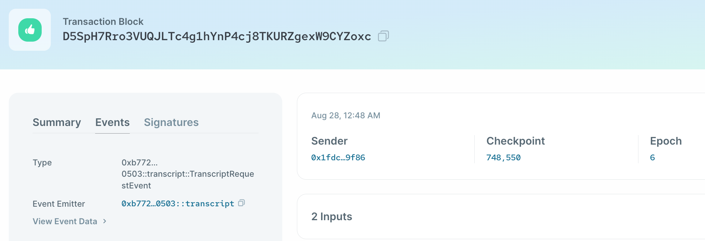
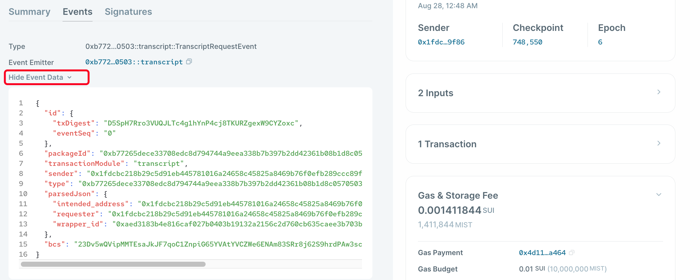

# Events

Events are important for Sui Move smart contracts, as it is the main way for indexers to track actions on-chain. You can understand it as logging on server backends and indexers as parsers.

Events on Sui are also represented as objects. There are several types of system-level events in Sui, including Move event, Publish event, Transfer object event, and so on. For the complete list of system event types, please refer to the [Sui Events API page here](https://docs.sui.io/build/event_api).

The event details of a transaction can be viewed on the [Sui Explorer](https://suiexplorer.com/) under the `Events` tab:



## Custom Events

Developers can also define custom events on Sui. Events should be named in **past tense** (they describe something that already happened). For example, an event for when a transcript has been requested:

```move
/// Event emitted when a transcript has been requested.
public struct TranscriptRequested has copy, drop {
    // The Object ID of the transcript wrapper
    wrapper_id: ID,
    // The requester of the transcript
    requester: address,
    // The intended address of the transcript
    intended_address: address,
}
```

Event types have the abilities `copy` and `drop`. They are not assets; we only care about the data, so they can be copied and dropped at the end of scopes.

To emit an event in Sui, you just need to use the [`sui::event::emit` method](https://github.com/MystenLabs/sui/blob/main/crates/sui-framework/docs/sui/event.md#function-emit).

Let's modify our `request_transcript` method to emit this event:

```move
public fun request_transcript(
    transcript: WrappableTranscript,
    intended_address: address,
    ctx: &mut TxContext,
) {
    let folder_object = Folder {
        id: object::new(ctx),
        transcript,
        intended_address,
    };
    event::emit(TranscriptRequested {
        wrapper_id: object::id(&folder_object),
        requester: ctx.sender(),
        intended_address,
    });
    // We transfer the wrapped transcript object directly to the intended address
    transfer::transfer(folder_object, intended_address);
}
```

On the Sui explorer, we can see the emitted event with the three data fields defined in `TranscriptRequested`:



**Here is the complete version of the transcript sample project: [transcript.move](../example_projects/transcript/sources/transcript.move)**

Try out creating, requesting and unpacking transcripts using the Sui CLI client and the Sui explorer to check the result.

That's the end of Unit 2, great job!
